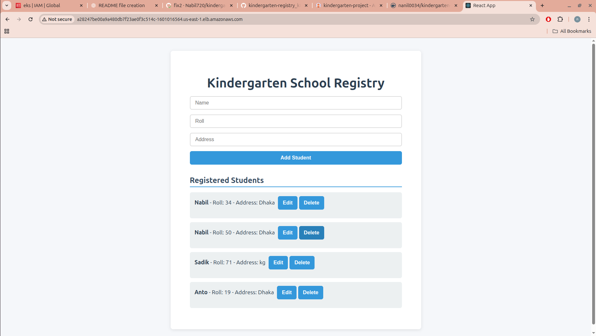
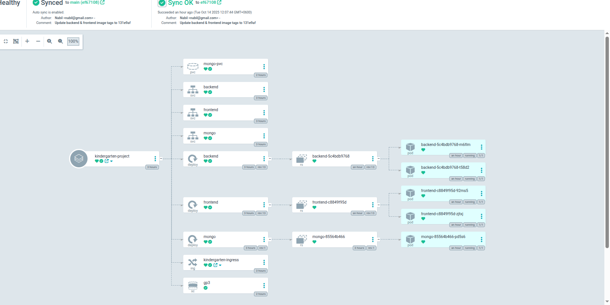
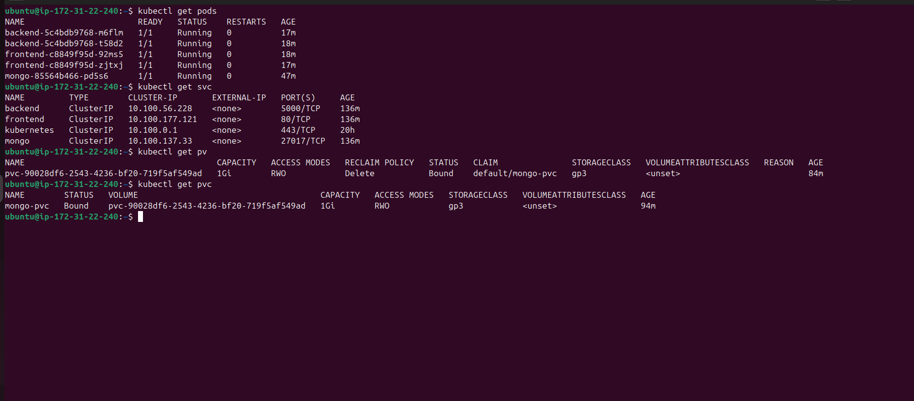

# Linux based hosting

## Kindergarten Registry — React + Go + MongoDB (Deployed with Nginx)

This project is a Kindergarten Registry Management System built using React (frontend), Go (backend), and MongoDB (database).  
It is deployed on an AWS EC2 (Ubuntu t3.micro) instance using Nginx as a reverse proxy.

---

## Project Structure
```
All_Project/
├── kindergarten-registry/
│ ├── backend/ # Go server (API)
│ ├── frontend/ # React application
│ ├── docker-compose.yml # MongoDB service
```

---


## Step-by-Step Deployment Guide

### Launch EC2 Instance
1. Create an EC2 instance using **Ubuntu 22.04 (t3.micro)**.  
2.  Connect via SSH:
   ```bash
   ssh -i key.pem ubuntu@<EC2_PUBLIC_IP>
```

###  Clone the Repository
```
cd ~
git clone https://github.com/Nabil720/All_Project.git
```

### Install Required Packages
```
sudo apt update && sudo apt upgrade -y
sudo apt install -y nginx docker.io docker-compose nodejs npm golang-go

# Verify
nginx -v
docker -v
go version
node -v
```
### Set Up MongoDB
```
cd All_Project/kindergarten-registry
nano docker-compose.yml

version: '3.8'

services:
  mongo:
    image: mongo
    container_name: mongo
    restart: unless-stopped
    ports:
      - "27017:27017"
    volumes:
      - mongo_data:/data/db

volumes:
  mongo_data:

# Run MongoDB
docker-compose up -d

```

### Setup and Run Backend and Frontend
```
cd backend
go mod init backend
go mod tidy
go run main.go

cd ../frontend
npm install
npm run build
```

### Configure Nginx
```
# Backup default configuration
sudo mv /etc/nginx/sites-available/default /etc/nginx/sites-available/default.bak

# Create a new config file
sudo nano /etc/nginx/sites-available/kindergarten.conf

server {
    listen 80;
    server_name 34.236.155.125;

    root /home/ubuntu/All_Project/kindergarten-registry/frontend/build;
    index index.html;

    location / {
        try_files $uri /index.html;
    }

    location /api/ {
        proxy_pass http://localhost:5000/;
        proxy_http_version 1.1;
        proxy_set_header Upgrade $http_upgrade;
        proxy_set_header Connection 'upgrade';
        proxy_set_header Host $host;
        proxy_cache_bypass $http_upgrade;
    }
}


# Enable the configuration and restart Nginx
sudo ln -s /etc/nginx/sites-available/kindergarten.conf /etc/nginx/sites-enabled/
sudo nginx -t
sudo systemctl restart nginx
sudo systemctl enable nginx
```

### Fix File Permissions
```
sudo chmod -R 755 /home/ubuntu/All_Project/kindergarten-registry/frontend/build
sudo chmod +x /home/ubuntu
sudo chmod +x /home/ubuntu/All_Project
sudo chmod +x /home/ubuntu/All_Project/kindergarten-registry
sudo chmod +x /home/ubuntu/All_Project/kindergarten-registry/frontend
sudo systemctl reload nginx
```

### Access the Application
```
http://34.236.155.125

```


-----------------------------------------------------------------------------------------------------------------


# Docker based hosting

## Kindergarten Registry

A full-stack React + Node.js + MongoDB application deployed using Docker.
```
All_Project/
└── kindergarten-registry/
    ├── backend/          # Node.js/Express backend
    ├── frontend/         # React frontend
    │   ├── build/        # Production build (generated)
    │   └── nginx.conf    # Nginx reverse proxy config
    └── docker-compose.yml
```

### nginx.conf
```
server {
    listen 80;

    server_name _;

    root /usr/share/nginx/html;
    index index.html index.htm;

    # React SPA routing
    location / {
        try_files $uri /index.html;
    }

    # Backend API reverse proxy
    location /api/ {
        proxy_pass http://backend:5000/;
        proxy_http_version 1.1;
        proxy_set_header Upgrade $http_upgrade;
        proxy_set_header Connection 'upgrade';
        proxy_set_header Host $host;
        proxy_cache_bypass $http_upgrade;
    }
}
```
## frontend/Dockerfile
```

FROM nginx:alpine

COPY build/ /usr/share/nginx/html

COPY nginx.conf /etc/nginx/conf.d/default.conf

EXPOSE 80

CMD ["nginx", "-g", "daemon off;"]
```

## Setup & Installation

1. Clone the repository

```bash
git clone https://github.com/Nabil720/All_Project.git
cd All_Project/kindergarten-registry
```
2. Update system and install dependencies

```
sudo apt update -y
sudo apt upgrade -y
sudo apt install docker.io docker-compose -y
sudo systemctl start docker
sudo systemctl enable docker
sudo usermod -aG docker $USER
newgrp docker
```

3. Build frontend

```
cd frontend
npm install
npm run build
```

docker-compose up -d


------------------------------------------------------------------------------------------------------------


# EKS Cluster based hosting


## Install Tools

```
# update
sudo apt update -y
sudo apt upgrade -y

# Install jq, curl, unzip 
sudo apt install -y curl unzip jq

# Install AWS CLI v2
curl "https://awscli.amazonaws.com/awscli-exe-linux-x86_64.zip" -o "awscliv2.zip"
unzip awscliv2.zip
sudo ./aws/install
rm -rf awscliv2.zip aws

# Install kubectl
curl -LO "https://dl.k8s.io/release/$(curl -L -s https://dl.k8s.io/release/stable.txt)/bin/linux/amd64/kubectl"
sudo install -o root -g root -m 0755 kubectl /usr/local/bin/kubectl
rm kubectl

# Install eksctl (the easiest way to create EKS)
curl --silent --location "https://github.com/weaveworks/eksctl/releases/latest/download/eksctl_$(uname -s)_amd64.tar.gz" | tar xz -C /tmp
sudo mv /tmp/eksctl /usr/local/bin

# (Optional) Install helm if you want to use it later
curl https://raw.githubusercontent.com/helm/helm/main/scripts/get-helm-3 | bash

```
## AWS CLI credentials
```
aws configure
# AWS Access Key ID [None]: <YOUR_ACCESS_KEY>
# AWS Secret Access Key [None]: <YOUR_SECRET_KEY>
# Default region name [None]: us-east-1   
# Default output format [None]: json
```
## EKS Cluster
```
eksctl create cluster \
  --name kindergarten-cluster \
  --region us-east-1 \
  --nodegroup-name ng-standard \
  --node-type t3.small \
  --nodes 2 \
  --nodes-min 1 \
  --nodes-max 3 \
  --managed

# Chack
kubectl get nodes
kubectl get ns
```

## Install Argo CD

```
# create namespace and install
kubectl create namespace argocd
kubectl apply -n argocd -f https://raw.githubusercontent.com/argoproj/argo-cd/stable/manifests/install.yaml

# Argo CD server expose
kubectl -n argocd patch svc argocd-server -p '{"spec": {"type": "LoadBalancer"}}'
kubectl get svc -n argocd

# Argo CD initial password
kubectl -n argocd get secret argocd-initial-admin-secret -o jsonpath="{.data.password}" | base64 --decode; echo
```
## Nginx ingress controller install
```
helm repo add ingress-nginx https://kubernetes.github.io/ingress-nginx
helm repo update
helm install nginx-ingress ingress-nginx/ingress-nginx \
  --namespace ingress-nginx --create-namespace \
  --set controller.publishService.enabled=true

# chack
kubectl get svc -n ingress-nginx

```

## Need to add StorageClass

```
apiVersion: storage.k8s.io/v1
kind: StorageClass
metadata:
  name: gp3
provisioner: ebs.csi.aws.com
volumeBindingMode: WaitForFirstConsumer
reclaimPolicy: Delete
allowVolumeExpansion: true
```

## Amazon EBS CSI Driver

```
eksctl utils associate-iam-oidc-provider --region us-east-1 --cluster kindergarten-cluster --approve

# Driver

eksctl create addon \
  --name aws-ebs-csi-driver \
  --cluster kindergarten-cluster \
  --region us-east-1 \
  --service-account-role-arn arn:aws:iam::<ACCOUNT_ID>:role/AmazonEKS_EBS_CSI_DriverRole \
  --force
```






